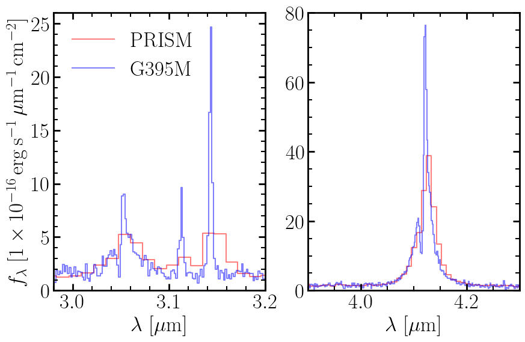

# NIRSpec Tutorial

This tutorial demonstrates fitting real JWST/NIRSpec spectra from the [Dawn JWST Archive (DJA)](https://dawn-cph.github.io/dja/) using `unite`'s built-in NIRSpec support. We fit H$\alpha$, H$\beta$, and [OIII] with a narrow + broad decomposition simultaneously across the PRISM and G395M gratings.

---

## NIRSpec Dispersers

`unite` ships with built-in calibrations for all NIRSpec gratings (PRISM, G140M/H, G235M/H, G395M/H). For each, two calibrations are available: calibrations from [JWST CRDS](https://jwst-docs.stsci.edu/jwst-near-infrared-spectrograph/nirspec-instrumentation/nirspec-dispersers-and-filters#NIRSpecDispersersandFilters-NIRSpecDispersersNIRSpecdispersers) assuming a uniformly illuminated slit and calibrations from [de Graaff et al. (2024)](https://ui.adsabs.harvard.edu/abs/2024A%26A...684A..87D/abstract) assuming a point source centered in the slit.

---

## Step 1 — Load the Spectra

Let's start by loading our NIRSpec spectra from the DJA. We'll use two gratings: PRISM (full wavelength coverage, low resolution) and G395M (H$\alpha$ region, high resolution). First, let's set up the dispersers that the spectra will use:

```python
import astropy.units as u
import numpy as np
from matplotlib import pyplot

from unite.instrument import (
    FluxScale,
    InstrumentConfig,
    PixOffset,
    RScale,
    Spectra,
    nirspec,
    prior,
)

# Create a shared resolution scale factor (accounts for PSF/slit illumination uncertainty)
resolution_scale = RScale(
    prior=prior.TruncatedNormal(low=0.8, high=1.2, loc=1.0, scale=0.1)
)

# PRISM is our nominal grating; G395M gets flux and pixel calibration offsets
# (These priors are based on de Graaff et al. 2024 Fig 8-9)
prism_disperser = nirspec.PRISM(r_source='point', r_scale=resolution_scale)
g395m_disperser = nirspec.G395M(
    r_source='point',
    r_scale=resolution_scale,
    flux_scale=FluxScale(
        prior=prior.TruncatedNormal(low=0.6, high=1.2, loc=0.9, scale=0.1)
    ),
    pix_offset=PixOffset(
        prior=prior.TruncatedNormal(low=-0.2, high=0.4, loc=0.2, scale=0.1)
    ),
)

instrument_config = InstrumentConfig([prism_disperser, g395m_disperser])
```

Now load the spectra from the DJA (with caching for faster repeat runs):

```python
g395m_spectrum = nirspec.NIRSpecSpectrum.from_DJA(
    'https://s3.amazonaws.com/msaexp-nirspec/extractions/'
    'rubies-egs53-v4/rubies-egs53-v4_g395m-f290lp_4233_42046.spec.fits',
    disperser=g395m_disperser,
    cache=True,
)
prism_spectrum = nirspec.NIRSpecSpectrum.from_DJA(
    'https://s3.amazonaws.com/msaexp-nirspec/extractions/'
    'rubies-egs53-v4/rubies-egs53-v4_prism-clear_4233_42046.spec.fits',
    disperser=instrument_config['PRISM'],
    cache=True,
)

spectra = Spectra([prism_spectrum, g395m_spectrum], redshift=5.2772)
```

Let's plot the spectra to see what we're working with:

```python
fig, axes = pyplot.subplots(1, 2, figsize=(10, 6))
for ax in axes:
    for i, spectrum in enumerate(spectra):
        ax.plot(
            spectrum.wavelength,
            spectrum.flux,
            label=spectrum.disperser.name,
            ds='steps-mid',
            color='rb'[i],
            alpha=0.5,
        )
axes[0].set(
    xlabel=r'$\lambda$ [μm]',
    ylabel=r'$f_\lambda$ [erg s$^{-1}$ cm$^{-2}$ Å$^{-1}$]',
    xlim=[2.98, 3.2],
    ylim=[0, 26],
)
axes[0].legend()
axes[1].set(xlabel=r'$\lambda$ [μm]', xlim=[3.9, 4.3], ylim=[0, 80])
fig.tight_layout()
fig.savefig('nirspec_spectra.png')
pyplot.close(fig)
```



Notice the PRISM covers all the lines at low resolution, while G395M provides high-resolution coverage of H$\alpha$. We can see clear emission lines: H$\beta$ (rest 4861 Å, observed ~2.46 μm), [OIII] doublet (rest 4960/5008 Å, ~2.51/2.54 μm), and H$\alpha$ (rest 6563 Å, ~3.32 μm). There's also evidence of absorption features and broad wings on the emission lines.

---

## Step 2 — Configure the Lines

Based on what we see in the spectra, we'll fit a complex line model: narrow + broad emission components plus blueshifted absorption. Let's build this configuration:

```python
from unite import prior
from unite.line import FWHM, Flux, LineConfiguration, Param, Redshift

line_configuration = LineConfiguration()

# Create a shared redshift parameter (relative offset from fiducial z=5.2772)
z_common = Redshift('z', prior=prior.Uniform(-0.005, 0.005))

# Narrow component: constrain to ~100–500 km/s (typical for star-forming regions)
fwhm_narrow = FWHM('narrow', prior=prior.Uniform(100, 500))

# Broad component: must be at least 150 km/s wider than narrow
# This ensures the prior is physically meaningful
fwhm_broad = FWHM('broad', prior=prior.Uniform(fwhm_narrow + 150, 5000))

# Absorption component: constrained between narrow and broad
# This captures outflow signatures with intermediate kinematics
fwhm_absorption = FWHM(
    'absorption',
    prior=prior.Uniform(fwhm_narrow + 150, fwhm_broad - 150),
)

# Add narrow Balmer lines (H-alpha and H-beta) with shared kinematics
line_configuration.add_line(
    'Halpha', 6563 * u.AA, profile='Gaussian', redshift=z_common, fwhm_gauss=fwhm_narrow
)
line_configuration.add_line(
    'Hbeta', 4861 * u.AA, profile='Gaussian', redshift=z_common, fwhm_gauss=fwhm_narrow
)

# Add [OIII] doublet with fixed flux ratio (4960/5008 = 1/3 by atomic physics)
line_configuration.add_lines(
    'OIII',
    np.array([4960, 5008]) * u.AA,
    profile='Gaussian',
    redshift=z_common,
    fwhm_gauss=fwhm_narrow,
    strength=[1.0, 3.0],
)

# Broad components: use exponential profile to capture extended wings
# Independent fluxes for H-alpha and H-beta
line_configuration.add_lines(
    'Broad',
    np.array([6563, 4861]) * u.AA,
    profile='exponential',
    redshift=z_common,
    fwhm_exp=fwhm_broad,
    flux=[
        Flux('Ha_broad'),
        Flux('Hb_broad'),
    ],
)

# Absorption components: blueshifted, with Gauss-Hermite profile
# h3/h4 account for asymmetry in the velocity structure
line_configuration.add_lines(
    'Absorption',
    np.array([6563, 4861]) * u.AA,
    profile='gauss-hermite',
    redshift=Redshift('abs', prior=prior.Uniform(-0.01, 0)),  # Negative = blueshifted
    fwhm_gauss=fwhm_absorption,
    h3=Param(
        'h3', prior=prior.TruncatedNormal(low=-0.3, high=0.1, loc=0.0, scale=0.1)
    ),
    h4=Param('h4', prior=prior.TruncatedNormal(low=-0.3, high=0.3, loc=0.0, scale=0.1)),
    flux=[
        Flux('Ha_abs', prior=prior.Uniform(-1, 0)),
        Flux('Hb_abs', prior=prior.Uniform(-1, 0)),
    ],
)

print(line_configuration)
```

Output:
```
LineConfiguration: 8 lines, 8 flux / 2 z / 4 profile params

  Name        Wavelength        Profile       Redshift  Params              Flux                Strength
  ----------  ----------------  ------------  --------  ------------------  ------------------  --------
  Halpha      6563.00 Angstrom  Gaussian      z         narrow              Halpha-6563.0-flux  1.00
  Hbeta       4861.00 Angstrom  Gaussian      z         narrow              Hbeta-4861.0-flux   1.00
  OIII        4960.00 Angstrom  Gaussian      z         narrow              OIII-4960.0-flux    1.00
  OIII        5008.00 Angstrom  Gaussian      z         narrow              OIII-5008.0-flux    3.00
  Broad       6563.00 Angstrom  Gaussian      z         narrow              Ha                  1.00
  Broad       4861.00 Angstrom  Gaussian      z         narrow              Hb                  1.00
  Absorption  6563.00 Angstrom  GaussHermite  abs       absorption, h3, h4  Ha_abs              1.00
  Absorption  4861.00 Angstrom  GaussHermite  abs       absorption, h3, h4  Hb_abs              1.00

  Redshift:
    z    Uniform(low=-0.005, high=0.005)
    abs  Uniform(low=-0.01, high=0.0)

  Params (fwhm_gauss):
    narrow      Uniform(low=100.0, high=500.0)
    absorption  Uniform(low=Reference(narrow + 150.0), high=Reference(broad - 150.0))

  Params (h3):
    h3  TruncatedNormal(loc=0.0, scale=0.1, low=-0.3, high=0.1)

  Params (h4):
    h4  TruncatedNormal(loc=0.0, scale=0.1, low=-0.3, high=0.3)

  Flux:
    Halpha-6563.0-flux  Uniform(low=-3.0, high=3.0)
    Hbeta-4861.0-flux   Uniform(low=-3.0, high=3.0)
    OIII-4960.0-flux    Uniform(low=-3.0, high=3.0)
    OIII-5008.0-flux    Uniform(low=-3.0, high=3.0)
    Ha                  Uniform(low=-3.0, high=3.0)
    Hb                  Uniform(low=-3.0, high=3.0)
    Ha_abs              Uniform(low=-1.0, high=0.0)
    Hb_abs              Uniform(low=-1.0, high=0.0)
```

We have 8 unique flux parameters, 2 redshift tokens (z and abs), and 4 profile shape parameters (narrow, broad, absorption FWHMs and h3/h4).

---

## Step 3 — Configure the Continuum

Auto-generate a continuum configuration by padding around each line and merging overlapping regions:

```python
from unite.continuum import ContinuumConfiguration, Linear

cc = ContinuumConfiguration.from_lines(
    line_configuration.centers,
    pad=0.05,  # Padding in redshift units
    form=Linear(),
)
print(cc)
```

Output:
```
ContinuumConfiguration: 2 region(s), 6 parameter(s)

  Range             Form          Parameters
  ----------------  ------------  -------
  3988 – 4087 Å     Linear        3 param(s)
  6384 – 6745 Å     Linear        3 param(s)

  Parameters (scale):
    cont_linear_0_scale                 Uniform(low=-10.0, high=10.0)
    cont_linear_1_scale                 Uniform(low=-10.0, high=10.0)

  Parameters (slope):
    cont_linear_0_slope                 Uniform(low=-10.0, high=10.0)
    cont_linear_1_slope                 Uniform(low=-10.0, high=10.0)

  Normalization wavelengths:
    cont_linear_0_normalization_wavelength  Fixed(4037.5)
    cont_linear_1_normalization_wavelength  Fixed(6564.5)
```

This creates independent linear continua around each line group, which is appropriate for our relatively narrow spectral regions.

---

## Step 4 — Prepare the Spectra

Now we filter which lines are actually observable in each spectrum and compute flux scales:

```python
filtered_lines, filtered_cont = spectra.prepare(line_configuration, cc)

spectra.compute_scales(
    filtered_lines,
    filtered_cont,
    max_fwhm=2000 * u.km / u.s,  # Not a hard limit; used for scale estimation
    line_mask_fwhm=10_000 * u.km / u.s,  # Wide window to capture line wings
    error_scale=True,  # Auto-rescale errors per region if needed
)

print(f'Line scale:      {spectra.line_scale:.4g}')
print(f'Continuum scale: {spectra.continuum_scale:.4g}')
for s in spectra:
    print(f'Error scale for {s.name}: {s.error_scale}')
```

Output:
```
Line scale:      1.389e-17 erg / (s cm2 Angstrom)
Continuum scale: 8.321e-18 erg / (s cm2 Angstrom)
Error scale for prism-clear: [ ... ]
Error scale for g395m-f290lp: [ ... ]
```

`compute_scales()` does three things:

1. Masks the lines and fits a low-order polynomial to estimate continuum level
2. Measures the peak line height above continuum, multiplies by a nominal width to estimate integrated flux
3. If `error_scale=True`, rescales per-spectrum errors so that $\chi^2_\nu = 1$ per region

These scales are used internally to normalize the flux priors and bring the likelihood into a numerically stable range.

---

## Step 5 — Fit the Spectra

Build the Bayesian model and run MCMC. You can use the convenience `fit()` method or build the model manually for more control:

```python
from unite import model

builder = model.ModelBuilder(filtered_lines, filtered_cont, spectra)

# Convenience method: one-liner
samples, model_args = builder.fit(num_warmup=200, num_samples=500, num_chains=1)

# OR for more control, use build() directly and customize the sampler:
# model_fn, model_args = builder.build()
# import jax
# from numpyro import infer
# mcmc = infer.MCMC(infer.NUTS(model_fn), num_warmup=200, num_samples=500)
# mcmc.run(jax.random.PRNGKey(0), model_args)
# samples = mcmc.get_samples()
```

---

## Step 6 — Extract and Visualize Results

Extract parameter estimates and model predictions across all posterior samples:

```python
from unite.results import make_parameter_table, make_spectra_tables

# Return all samples
param_table = make_parameter_table(samples, model_args)
spectra_tables = make_spectra_tables(samples, model_args)

# Return specific samples
param_table = make_parameter_table(samples, model_args, percentiles=percentiles)
spectra_tables = make_spectra_tables(samples, model_args, percentiles=percentiles)

print(param_table)
```

Output:
```
percentile        z       narrow  ...  Ha_broad_flux  Ha_abs_flux    Ha_rew
            0.16     0.0001  180.52  ...    3.4e-17    -5.2e-17  3.2 Angstrom
             0.5     0.0008  245.18  ...    6.8e-17    -2.1e-17  8.5 Angstrom
            0.84     0.0015  310.94  ...    9.1e-17     1.2e-17  13.1 Angstrom
```

Now plot the data and best-fit model (using median posterior prediction):

```python

# To make plotting easier, you can also provide a version 
# of the spectra tables with NaN's inserted between regions
spectra_tables = make_spectra_tables(samples, model_args, insert_nan=True)


fig, axes = pyplot.subplots(figsize=(12, 6), sharex='column')

# Data (with error bars)
for i, s in enumerate(spectra):
    for ax in axes[0]:
        ax.step(s.wavelength, s.flux, color='rb'[i], label=s.name, where='mid', alpha=0.7)

# # Model (median posterior)
# for i, table in enumerate(spectra_tables):
#     ax.step(
#         table['wavelength'],
#         table['model_total'],
#         color=colors[i],
#         lw=2,
#         where='mid',
#         linestyle='--',
#     )

# ax.set_xlabel(r'$\lambda$ [μm]', fontsize=12)
# ax.set_ylabel(r'$f_\lambda$ [erg s$^{-1}$ cm$^{-2}$ Å$^{-1}$]', fontsize=12)
# ax.legend(fontsize=11)
# ax.set_xlim([2.98, 4.5])
# fig.tight_layout()
fig.savefig('nirspec_fit.png')
pyplot.close(fig)
```


---

## Understanding Your Samples

The `samples` dictionary has keys for every fitted parameter (e.g., `'z'`, `'narrow'`, `'Ha_narrow_flux'`) and shape `(num_chains, num_samples)` for each.

**Parameter table:** Shows medians and credible intervals (16th, 50th, 84th percentiles). Dependent priors (like `fwhm_broad = fwhm_narrow + 150`) are already resolved in the samples—the constraints are automatically satisfied.

**Spectra tables:** One per spectrum, with columns:
- `wavelength` — pixel center wavelengths
- `continuum_{i}` — continuum contribution per region
- `line_{i}` — individual line flux predictions
- `model_total` — sum of all components

From the samples, you can compute uncertainties on any derived quantity (equivalent width, line center shifts, kinematic widths, etc.) via posterior resampling.

---

## Multi-Grating Fitting Notes

When fitting multiple gratings simultaneously, `unite` handles several important details:

- **Per-spectrum coverage filtering:** Lines only visible in one grating are modeled only in that grating
- **Calibration tokens:** `FluxScale` and `PixOffset` on individual dispersers introduce free parameters for relative calibration, useful when absolute calibrations are uncertain
- **Resolution scaling:** `RScale` on shared tokens allows the LSF width to be a free parameter, accounting for PSF/slit calibration uncertainty
- **PRISM's variable resolution:** R ranges from ~30–300 across the spectrum; `unite` uses wavelength-dependent LSF calibrations to handle this

---

## Next Steps

- See {doc}`../guides/line_configuration` for advanced line setup (multiplets, custom priors, intrinsic line shapes)
- See {doc}`../guides/continuum_configuration` for more continuum forms (power-law, polynomial, spline, blackbody)
- See {doc}`../guides/instruments` for custom dispersers, serial spectroscopy, and other instruments
- See {doc}`../guides/results` for extracting equivalent widths, kinematics, and other line properties from samples
